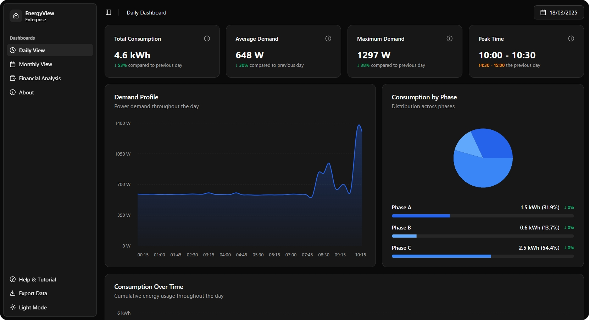

# EnergyView

[EnergyView](https://energyview.vercel.app/) is a cutting-edge research and development initiative in the Digital Twin domain, aimed at building a robust, distributed system for real-time energy monitoring and analysis.

This repository houses the front-end component of the project.

<p>
  
  
</p>

<p>
  
  
</p>

The platform captures granular consumption and demand data from the Software Laboratory of the Electrical Engineering Building at Poli-USP through a network of IoT devices. This data is then processed and transformed into intuitive dashboards that enable detailed analysis of energy usage patterns.

## Features

- Real-time energy monitoring
- Intuitive dashboards for data visualization
- Detailed analysis of energy usage patterns
- Responsive design

## Running

### Requirements

- Node.js
- npm (Node Package Manager)

### How to run

1. Clone the repository;
2. Open a terminal and _cd_ into the repository's directory;
3. Run `npm post-clone` to install and initialize dependencies;
4. Run `npm run dev` to serve the app.

## Code Quality

To ensure code quality and consistency, the following tools are included:

- **Formatting**: Use Prettier to automatically format your code according to the project's style guidelines.

  ```bash
  npm run format
  ```

- **Linting**: Employ ESLint to identify and address code quality issues.

  ```bash
  npm run lint
  ```

- **Format and Lint**: Run both formatting and linting in one step to ensure your code meets all quality standards.

  ```bash
  npm run check
  ```

  We use [Husky](https://typicode.github.io/husky/#/) to enforce code quality. The _check_ script runs before each commit to perform formatting checks with Prettier and linting checks with ESLint, in that order. The commit will only proceed if all checks pass.

## Contributing

We welcome contributions from the community! To get started, please follow these guidelines:

### Commit Message Guidelines

Please ensure your commit messages adhere to the following format:

```
<type>(<scope>): <subject>
```

#### Types

- **feat**: A new feature
- **fix**: A bug fix
- **docs**: Documentation only changes
- **style**: Changes that do not affect the meaning of the code (white-space, formatting, missing semi-colons, etc)
- **refactor**: A code change that neither fixes a bug nor adds a feature
- **perf**: A code change that improves performance
- **test**: Adding missing tests or correcting existing tests
- **chore**: Changes to the build process or auxiliary tools and libraries such as documentation generation

#### Scope

The scope should be the name of the module affected (as perceived by the person reading the changelog generated from commit messages). It could also be something like the feature worked on, etc.

#### Subject

The subject contains a succinct description of the change:

- Use the imperative, present tense: "change" not "changed" nor "changes"
- Do not capitalize the first letter
- Do not end the subject with a period

### Pull Request Process

1. Fork the repository.
2. Create your feature branch (`git checkout -b feature/your-feature`).
3. Commit your changes (`git commit -m 'feat(scope): add new feature'`).
4. Push to the branch (`git push origin feature/your-feature`).
5. Open a pull request.

## License

This project is licensed under the GPL-3 License. See the [LICENSE](./LICENSE) file for more details.
